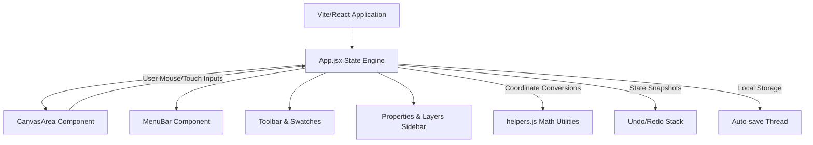

# StickOut — Developer & System Documentation

Welcome to the **StickOut** developer documentation. StickOut is an open-source, interactive, browser-based EDA (Electronic Design Automation) tool designed for creating, editing, and validating VLSI (Very-Large-Scale Integration) stick diagrams. 

This document details the software architecture, design patterns, algorithmic implementations, and data structures utilized in the codebase.

---

## 🗺️ System Overview & Architecture

StickOut is designed as a single-page React application powered by Vite, utilizing an interactive HTML5 Canvas element for rendering layout components. 



### Key Design Principles:
1. **Model-View-Controller (MVC) Pattern**: React handles the data model state (`elements`, `selectedIds`, `canvasLayers`) and controls, while a high-performance rendering loop draws the state onto the canvas (View).
2. **Infinite 2D Workspace**: The coordinate system coordinates screen space (pixels) with world space (grid units) using dynamic 2D transforms (scaling and translations).
3. **Z-Indexed Layer Stack**: Standard layers are drawn sequentially based on a customized ordering. Canvas layers mimic professional raster/vector graphics packages (e.g., Photoshop) by supporting locking, visibility toggling, opacity mixing, and drag-and-drop hierarchy.

---

## 🎨 Technology Stack
* **Build System & Bundler**: Vite 8 (Hot Module Replacement enabled)
* **Framework**: React 19 (Hooks: `useState`, `useRef`, `useEffect`, `useCallback`)
* **Vector Icons**: Lucide React
* **Styling**: Pure CSS3 with custom properties (CSS variables) for robust light and dark mode toggling.
* **Canvas API**: Raw HTML5 Canvas Context 2D for custom, pixel-perfect layout renderings.

---

## 📦 Project Directory Structure

The project has a modular frontend layout structured as follows:

```
stick-diagram/
├── public/                 # Static assets (favicons, manifest files)
├── src/
│   ├── assets/             # Branding and verification graphics
│   ├── components/         # Reusable React components
│   │   ├── CanvasArea.jsx  # HTML5 Canvas viewport, events, and text editing input
│   │   ├── LayersPanel.jsx # Photoshop-style canvas layer manager & reordering
│   │   ├── MenuBar.jsx     # Dropdown menus for file actions, edit commands, and view toggles
│   │   ├── Modals.jsx      # Startup splash, export dialog, and feedback overlay
│   │   ├── PropertiesPanel.jsx # Contextual inspector for modifying elements' dimensions and properties
│   │   ├── StatusBar.jsx   # Status display (coordinates, active tool, current scale ratio)
│   │   └── Toolbar.jsx     # Tool controls (Select, Line, Via, Text, Brush, Eraser) and swatches
│   ├── App.css             # Component-specific styles, layout grids, and animations
│   ├── App.jsx             # Root React component, event coordinator, and central state manager
│   ├── constants.js        # Hardcoded configs, default VLSI layers, zoom limits
│   ├── helpers.js          # Pure canvas drawing functions, geometric calculations, and coordinate transforms
│   ├── index.css           # Global resets, typography, and dark/light color schemes variables
│   └── main.jsx            # Application mount entrypoint
├── index.html              # HTML shell template
├── package.json            # NPM dependencies and scripts
└── vite.config.js          # Vite configurations
```

---

## 💾 State Management & Data Schema

### Core State Fields (`App.jsx`)
* `elements` (Array of objects): Stores all graphical features drawn on the canvas.
* `selectedIds` (Set of strings): Holds the IDs of currently selected elements.
* `activeTool` (`select`, `line`, `contact`, `label`, `brush`, `eraser`): Current cursor operation.
* `canvasLayers` (Array of objects): Reorderable list of drawing layers. Each has:
  * `id`: String identifier.
  * `name`: String label.
  * `visible`: Boolean flag.
  * `opacity`: Float value from `0.0` to `1.0`.
  * `isCustom`: Boolean indicating if created by the user (as opposed to auto-generated VLSI layers).
* `undoStack` & `redoStack`: Snapshots of `elements` and `canvasLayers` capped at 50 levels of history.
* `jumpOverrides` (Set of strings): Serialized coordinate strings (`"x,y"`) where automatic crossover jumps are suppressed and rendered as solid electrical connections.

### Element Schema Examples

#### 1. Wire / Line Element
```json
{
  "id": "el-1",
  "type": "line",
  "x1": 200,
  "y1": 100,
  "x2": 400,
  "y2": 100,
  "layerId": "metal1",
  "color": "#4A90E2",
  "label": "VDD",
  "canvasLayerId": "canvas_vlsi_metal1"
}
```

#### 2. Contact / Via Element
```json
{
  "id": "el-2",
  "type": "via",
  "x": 300,
  "y": 100,
  "size": "small",      // "small" (0.5 pitch), "medium" (0.8 pitch), or "big" (1.2 pitch)
  "shape": "x",         // "x" (classic VLSI crossed connection) or "square"
  "layerId": "via",
  "color": "#9C27B0",
  "canvasLayerId": "canvas_vlsi_via"
}
```

#### 3. Text Label Element
```json
{
  "id": "el-3",
  "type": "label",
  "x": 300,
  "y": 86,
  "text": "V_{DD}",      // LaTeX-style subscripts parsed automatically
  "align": "center",    // "left" or "center"
  "hasBg": false,       // Renders opaque pill box backing if true
  "canvasLayerId": "canvas_vlsi_metal1"
}
```

#### 4. Freehand Brush Stroke Element
```json
{
  "id": "el-4",
  "type": "brush",
  "x": 0,
  "y": 0,
  "points": [
    { "x": 105, "y": 92 },
    { "x": 110, "y": 98 }
  ],
  "color": "#FF453A",
  "size": 5,
  "opacity": 0.8,
  "canvasLayerId": "layer_1"
}
```

### Save File Format (`.stk` / JSON)
Files downloaded/uploaded via **File -> Save Project / Open Project** represent serialized representations of the workspace state:
```json
{
  "format": "stickout",
  "version": 2,
  "savedAt": "2026-06-23T05:00:00.000Z",
  "elements": [...],
  "jumpOverrides": ["300,100", "400,200"],
  "canvasLayers": [...],
  "extraMetalLayers": [...],
  "customLayerColors": { "via": "#9C27B0" },
  "pan": { "x": 120, "y": 50 },
  "zoom": 1.1,
  "showGrid": true,
  "snapEnabled": true
}
```

---

## ⚡ Key Algorithms & Math Mechanics

### 1. Coordinate Conversions
To map physical mouse coordinates (screen space) to the zoomable/pannable coordinates (world space), the editor performs affine scaling transformations.

* **Screen to World (Input Handling)**:
  $$\text{world}_x = \frac{\text{screen}_x - \text{pan}_x}{\text{zoom}}$$
  $$\text{world}_y = \frac{\text{screen}_y - \text{pan}_y}{\text{zoom}}$$

* **World to Screen (Rendering/UI Overlay placement)**:
  $$\text{screen}_x = \text{world}_x \times \text{zoom} + \text{pan}_x$$
  $$\text{screen}_y = \text{world}_y \times \text{zoom} + \text{pan}_y$$

### 2. Same-Layer Wire Crossovers (Bridging)
When drawing orthogonal wires (a horizontal line and a vertical line) that share the same VLSI layer, they automatically render an arc bridge ("jump") to signal that they cross without an electrical connection. 

* **Crossover Search (`helpers.js -> getCrossovers`)**:
  1. Filter elements to identify horizontal wires and vertical wires.
  2. For every horizontal wire `h` and vertical wire `v` sharing the same `layerId`:
     * If the vertical wire's $X$ coordinate lies inside the horizontal wire's $X$-bounds ($X_{min} < X_v < X_{max}$) AND the horizontal wire's $Y$ coordinate lies inside the vertical wire's $Y$-bounds ($Y_{min} < Y_h < Y_{max}$):
       * Register a crossover coordinate point $(X_v, Y_h)$ referencing the two lines.
  3. During rendering, if a horizontal wire contains active crossover points, it is drawn in segments. For each crossover point, the straight line path is interrupted, and `ctx.arc()` draws a semi-circle bridge of radius $R = 6\text{px}$.
  4. Same-layer crossovers can be overridden to show a solid junction (a connection) by right-clicking on the bridge. This appends the bridge's coordinate string `"x,y"` to `jumpOverrides`, which bypasses segment splitting.

### 3. Group Scaling
When multiple wires are selected, dragging an endpoint of one of the wires executes a proportional scale of the entire selected group.
* **Proportional Calculation**:
  $$\text{ratio} = \frac{\text{New Length of Dragged Wire}}{\text{Original Length of Dragged Wire}}$$
* Other selected wires scale their length by multiplying their original length by the computed `ratio`.
* To enforce orthogonal layouts, coordinates snap to `GRID_PITCH` boundaries. Holding `Shift` restricts the multiplier to integer intervals ($1\times$, $2\times$, etc.).

### 4. Bounding Box & High-Resolution Export
To export high-quality images without empty margins, the canvas computes the collective bounding box of all visible objects.
1. Collect the geometric bounding boxes of all elements using type-specific boundaries (e.g., lines evaluate $X_1, Y_1, X_2, Y_2$, contacts evaluate center $\pm$ half-size, labels evaluate text string length multipliers).
2. Find the minimum and maximum $X$ and $Y$ coordinates ($X_{min}, Y_{min}, X_{max}, Y_{max}$).
3. Compute the bounding rectangle: $W = X_{max} - X_{min}$ and $H = Y_{max} - Y_{min}$.
4. Create an offscreen HTML5 canvas set to $2\times$ scale for sharp rendering.
5. Translate the drawing context by $(-X_{min} + \text{margin})$ and $(-Y_{min} + \text{margin})$ to align the drawing, then paint the layers.

### 5. Math subscript Sub-Rendering (`helpers.js -> drawLabelOnContext`)
Standard fonts do not render subscript indices gracefully. The text labels support LaTeX-style subscript processing:
* **Regex Engine**: Evaluates formats `Name_{subscript}` or `Name_subscript` (e.g., `V_{DD}`, `V_DD`).
* **Double-Pass Draw**: 
  1. Splices the string into `baseText` and `subText`.
  2. Renders `baseText` in an italic serif font style (Times New Roman) at size `14px`.
  3. Obtains metrics for `baseText` to find its horizontal width.
  4. Renders `subText` shifted to the right of `baseText` by `baseWidth + 1px` and offset vertically downward by `4px` in a smaller `10px` font.

---

## 🛠️ Developer Commands & Guide

To start developing or running tests locally, use the following scripts:

### Project Commands (run in terminal)
* **Install dependencies**: `npm install`
* **Local development server**: `npm run dev` (spins up local Vite server, typically on `http://localhost:5173/`)
* **Production Build**: `npm run build` (transpiles and bundles static files into the `dist/` directory)
* **Preview Production Build**: `npm run preview` (runs local server serving the `dist/` build)
* **Linter**: `npm run lint` (runs ESLint checks)

### Hotkeys and Keyboard Shortcuts (Canvas Controls)
* <kbd>V</kbd> — Select / Pointer Tool
* <kbd>W</kbd> — Wire / Line Tool
* <kbd>P</kbd> — Via / Contact Tool
* <kbd>L</kbd> / <kbd>T</kbd> — Label / Text Tool
* <kbd>B</kbd> — Freehand Paintbrush Tool
* <kbd>E</kbd> — Eraser Tool
* <kbd>G</kbd> — Toggle grid visibility
* <kbd>S</kbd> — Toggle grid snapping
* <kbd>Space</kbd> + Drag — Pan workspace canvas
* <kbd>Del</kbd> / <kbd>Backspace</kbd> — Delete selected element(s)
* <kbd>Ctrl</kbd> + <kbd>Z</kbd> — Undo
* <kbd>Ctrl</kbd> + <kbd>Y</kbd> — Redo
* <kbd>Ctrl</kbd> + <kbd>C</kbd> — Copy selected elements
* <kbd>Ctrl</kbd> + <kbd>X</kbd> — Cut selected elements
* <kbd>Ctrl</kbd> + <kbd>V</kbd> — Paste clipboard contents
* <kbd>Ctrl</kbd> + <kbd>D</kbd> — Duplicate selection (offset by 1 grid pitch)
* <kbd>Ctrl</kbd> + <kbd>A</kbd> — Select all elements
* <kbd>Esc</kbd> — Cancel active drawing or clear selections
